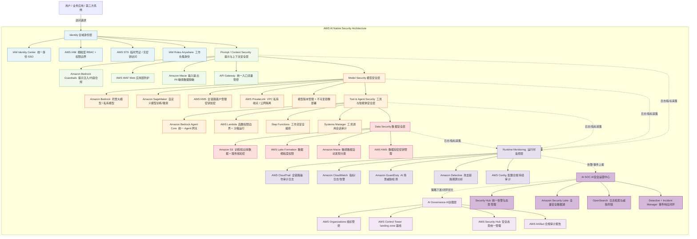

以下分别提供**AWS 平台 AI 原生安全落地架构**与 **Azure 平台 AI 原生安全落地架构**两份完整 Mermaid 代码，严格对应前文 8 层 AI 安全架构模型，全部采用厂商官方原生服务映射，可直接渲染使用。

---

## 一、AWS 平台 AI 原生安全落地架构图
完整对齐 8 层架构，以 Amazon Bedrock 为 AI 核心底座，全链路复用 AWS 原生安全服务，体现「身份优先、全链路审计、安全即代码」的云原生特性。

---

## 二、Azure 平台 AI 原生安全落地架构图
完整对齐 8 层架构，以 Azure OpenAI + Copilot 生态为核心，深度融合 Entra 身份体系与 Microsoft 安全生态，体现「零信任原生延伸、端到端一体化」的特性。

```mermaid
graph TD
    %% 顶层：访问入口
    User[用户 / 业务应用 / 终端设备] -->|访问请求| L2

    subgraph Azure AI Native Security Architecture
        %% L1 治理层
        L1[AI Governance  AI治理层]
        L1_1[Azure Policy  全租户安全基线策略]
        L1_2[Azure Resource Manager  资源统一管控]
        L1_3[Compliance Manager  合规评估与报告]
        L1_4[Microsoft Purview  统一治理与审计]
        L1 --> L1_1 & L1_2 & L1_3 & L1_4

        %% L2 全域身份层
        L2[Identity  全域身份层]
        L2_1[Microsoft Entra ID  统一身份目录]
        L2_2[Azure RBAC + PIM  细粒度权限 + 特权管理]
        L2_3[Managed Identity  工作负载托管标识]
        L2_4[Conditional Access  条件访问 + 持续访问评估]
        L2 --> L2_1 & L2_2 & L2_3 & L2_4

        %% L3 提示与上下文安全层
        L3[Prompt / Context Security  提示与上下文安全层]
        L3_1[Azure AI Content Safety  内容合规过滤]
        L3_2[Prompt Shield  提示词注入防护]
        L3_3[Azure WAF  应用层攻击防护]
        L3_4[Purview DLP  输入输出敏感数据防护]
        L2 --> L3
        L3 --> L3_1 & L3_2 & L3_3 & L3_4

        %% L4 模型安全层
        L4[Model Security  模型安全层]
        L4_1[Azure OpenAI Service  租户级模型隔离]
        L4_2[Azure Machine Learning  自定义训练/微调]
        L4_3[Customer Managed Key  客户管理密钥加密]
        L4_4[Azure Private Link  私有端点 + 公网阻断]
        L4_5[模型注册表 + 版本管控 + 不可变部署]
        L3 --> L4
        L4 --> L4_1 & L4_2 & L4_3 & L4_4 & L4_5

        %% L5 工具与智能体安全层
        L5[Tool & Agent Security  工具与智能体安全层]
        L5_1[Microsoft Copilot Studio  Agent 低代码编排]
        L5_2[Azure API Management  工具统一网关 + 鉴权]
        L5_3[Azure Functions / Logic Apps  工具执行 + 权限边界]
        L5_4[连接器权限管控 + 数据边界隔离]
        L4 --> L5
        L5 --> L5_1 & L5_2 & L5_3 & L5_4

        %% L6 数据安全层
        L6[Data Security  数据安全层]
        L6_1[Azure Blob / OneLake  训练/知识库存储]
        L6_2[Microsoft Purview  数据分类分级 + 血缘追踪]
        L6_3[Azure Information Protection  数据标签 + 权限保护]
        L6_4[Azure Key Vault  密钥与机密管理]
        L5 --> L6
        L6 --> L6_1 & L6_2 & L6_3 & L6_4

        %% L7 运行时监控层
        L7[Runtime Monitoring  运行时监控层]
        L7_1[Azure Monitor  统一指标 + 日志 + 告警]
        L7_2[Azure Activity Log  全租户操作审计]
        L7_3[Microsoft Defender for Cloud  云工作负载威胁检测]
        L7_4[Defender for AI  AI 场景专项威胁检测]
        L7_5[Azure Resource Graph  配置合规巡检]
        L3 & L4 & L5 & L6 -. 日志/指标采集 .-> L7
        L7 --> L7_1 & L7_2 & L7_3 & L7_4 & L7_5

        %% L8 AI SOC 层
        L8[AI SOC  AI安全运营中心]
        L8_1[Microsoft Sentinel  云原生 SIEM + SOAR]
        L8_2[Microsoft Defender XDR  跨域威胁联动响应]
        L8_3[Microsoft Copilot for Security  AI 辅助安全运营]
        L8_4[事件管理 + 响应剧本 + 持续优化闭环]
        L7 -. 告警/事件上报 .-> L8
        L8 -. 策略下发/闭环优化 .-> L1
        L8 --> L8_1 & L8_2 & L8_3 & L8_4
    end

    %% 全局样式
    classDef govern fill:#f3e7f5,stroke:#88419d,stroke-width:1px
    classDef identity fill:#e8f4f8,stroke:#2c7fb8,stroke-width:1px
    classDef frontline fill:#f0f9eb,stroke:#5aae61,stroke-width:1px
    classDef core fill:#fff3e0,stroke:#e6550d,stroke-width:1px
    classDef data fill:#fde0dd,stroke:#c51b8a,stroke-width:1px
    classDef detect fill:#e7e1ef,stroke:#6a51a3,stroke-width:1px
    classDef operate fill:#d4b9da,stroke:#7a0177,stroke-width:1px

    class L1,L1_1,L1_2,L1_3,L1_4 govern
    class L2,L2_1,L2_2,L2_3,L2_4 identity
    class L3,L3_1,L3_2,L3_3,L3_4 frontline
    class L4,L4_1,L4_2,L4_3,L4_4,L4_5 core
    class L5,L5_1,L5_2,L5_3,L5_4 core
    class L6,L6_1,L6_2,L6_3,L6_4 data
    class L7,L7_1,L7_2,L7_3,L7_4,L7_5 detect
    class L8,L8_1,L8_2,L8_3,L8_4 operate
```

---

### 架构说明
1.  **层级严格对应**：两份架构图均严格遵循前文「治理-身份-提示-模型-工具-数据-监控-运营」8 层模型，可与方法论一一对应。
2.  **全原生服务映射**：全部采用厂商官方安全服务，无第三方组件依赖，符合云原生最佳实践。
3.  **闭环逻辑完整**：体现「访问请求 → 逐层防护 → 全量监控 → 运营闭环 → 策略回灌」的完整安全生命周期，符合 NIST RMF 与零信任的核心思想。
4.  **可扩展性**：若企业采用混合模式（云原生底座 + 第三方专业 AI 安全网关），可在 L3 提示安全层插入第三方 LLM 安全网关节点，其余层级保持不变。

需要我再补充一张**混合云/多云场景的统一安全架构图**，或者细化某一层的控制项与配置基线吗？
