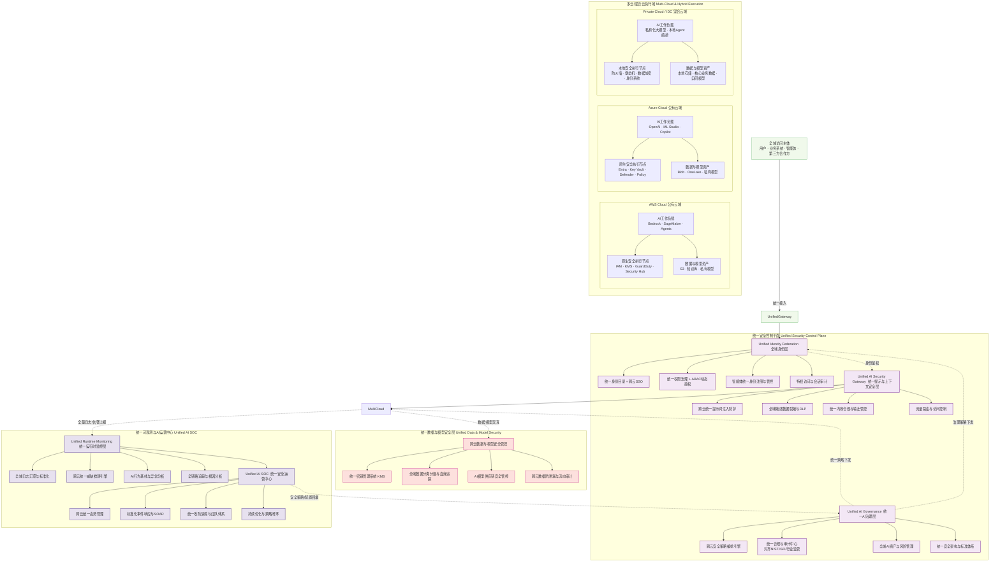

### 混合云 / 多云场景统一安全架构图（Mermaid 代码）
架构核心设计思想：**逻辑统一、物理分布、能力复用、避免厂商锁定**。顶层构建跨云统一安全控制平面，底层复用各云厂商原生安全执行能力，完整对齐 8 层 AI 原生安全方法论，同时兼容私有云/本地 IDC 混合部署场景。

---

### 架构核心设计说明
1.  **方法论完全对齐**
    架构自上而下完整对应 8 层 AI 原生安全体系：
    - 治理层、身份层、提示安全层、SOC 运营层**全域统一**，确保跨云架构标准一致、策略统一；
    - 模型安全、工具与 Agent 安全、数据安全、运行时监控采用「统一管控 + 云上原生执行」模式，既避免重复建设，又充分复用各云厂商原生能力。

2.  **三大核心设计原则**
    - **逻辑集中，物理分布**：安全策略、身份、运营、合规集中管控，安全执行与数据处理保留在各云/本地环境，满足数据驻留、低时延等要求。
    - **能力复用，避免锁定**：底层复用 AWS、Azure 原生安全服务，上层通过统一控制平面做标准化适配，不绑定单一厂商，支持灵活的多云调度与业务迁移。
    - **平滑兼容混合云**：私有云/本地 IDC 的 AI 系统通过统一网关、身份联邦、日志汇聚纳入整体架构，无需单独建设安全体系。

3.  **关键跨云能力落点**
    - **统一策略编排**：一套安全规则自动下发到多云环境，解决多云策略不一致、配置漂移问题；
    - **全域身份联邦**：一套身份体系打通所有云与本地环境，实现智能体、用户、工作负载的统一权限治理；
    - **统一 SOC 运营**：所有云与本地的安全日志、告警标准化汇聚，统一研判、统一响应、统一度量，避免多套运营体系割裂。

需要我再补充该架构对应的**跨云安全策略分级管控清单**，或者细化多云场景下的零信任授权流程吗？
